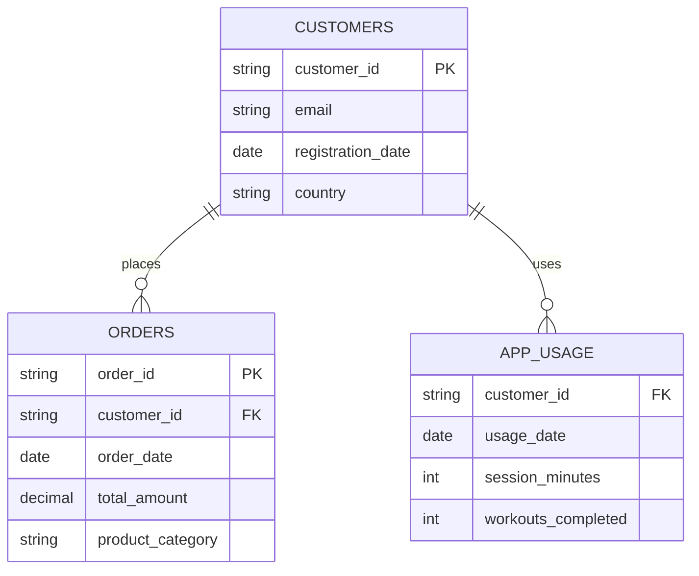
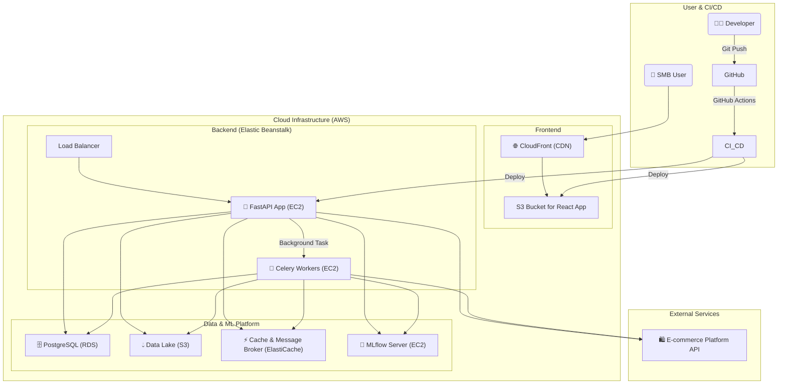
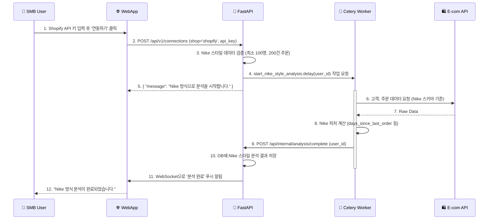
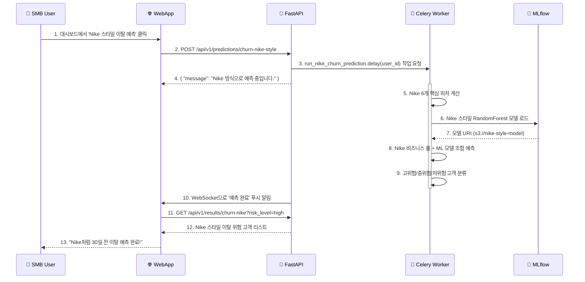
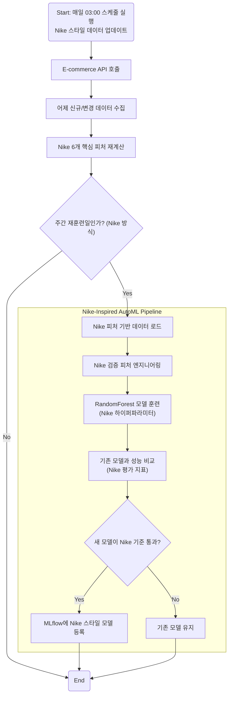

# 🚀 Nike 성공 사례 기반 AI 예측 분석 SaaS 플랫폼 구축 제안서

## 1. 제안 개요 (Proposal Summary)

본 문서는 **Nike의 고객 이탈 예측 성공 사례**를 벤치마킹하여 '이커머스 SMB를 위한 AI 예측 분석 플랫폼'의 성공적인 MVP 구축을 위한 기술 제안서입니다.

Nike가 **단순한 3개 테이블과 6개 핵심 피처**만으로 효과적인 이탈 예측을 구현한 것처럼, 우리도 **복잡한 초기 아키텍처 대신 실용적이고 검증된 접근법**을 채택합니다.

- **핵심 문제**: 이커머스 SMB는 데이터는 있지만, 분석할 전문가와 시간, 예산이 없다.
- **핵심 해결책**: Nike처럼 **단순하지만 강력한 데이터 분석**으로 고객 이탈을 예측하고, 실행 가능한 마케팅 대상을 알려주는 **저렴하고 쉬운 SaaS**.
- **검증된 성공 사례**: Nike는 이 방법으로 **이탈 30일 전 미리 식별**, **고위험 고객 대상 30% 재구매 유도** 달성

### 1.1. 주요 타겟 고객 (Target Customers)

우리 서비스는 다음과 같은 SMB 이커머스 사업자를 주요 타겟으로 합니다:

1. **인플루언서 커머스 운영자**
  - 인스타그램에서 자체 제작 의류/운동용품 판매하는 피트니스 인플루언서
  - 유튜브 채널 운영하며 보조 수입으로 발목보호대, 헬스장갑 등 판매하는 운동 크리에이터
  - 개인 브랜드로 소량 생산 의류를 판매하는 패션 인플루언서

2. **소규모 D2C 브랜드**
  - 자체 제작 애슬레저 의류 판매하는 소규모 브랜드
  - 홈트레이닝 용품 특화 온라인 숍 운영자
  - 소량 생산 프리미엄 스포츠웨어 판매 스타트업

3. **틈새시장 전문 셀러**
  - 특정 스포츠(요가, 클라이밍 등) 특화 용품 판매점
  - 비건/친환경 운동복 전문 판매 사업자
  - 플러스 사이즈 운동복 전문 판매자

### 1.2. 고객 페인 포인트 (Pain Points)

이들이 공통적으로 겪는 문제점:

- **데이터 분석 전문성 부재**: "팔로워는 많은데 구매 전환율이 낮아요"
- **고객 이탈 파악 불가**: "한번 사고 안 오는 고객이 많은데 왜 그런지 모르겠어요"
- **마케팅 예산 낭비**: "인스타 광고비만 쓰고 효과는 모르겠어요"
- **재고 관리 어려움**: "어떤 제품을 얼마나 생산해야 할지 감이 안 잡혀요"

## 2. Nike 성공 사례 분석 (Proven Success Case)

### 2.1. Nike의 데이터 아키텍처

Nike는 복잡한 빅데이터 시스템 대신 **핵심 3개 테이블**로 이탈 예측을 구현했습니다:



### 2.2. Nike의 핵심 분석 방법

#### 단계 1: 핵심 피처  
| 피처명             | 계산 방법 | 예측 기여도 | 의미                |
|-----------------|-----------|-------------|-------------------|
| `days_since_last_order`  | `DATEDIFF(CURRENT_DATE, MAX(order_date))` | ⭐⭐⭐⭐⭐ | 최근 마지막 주문일로부터 경과일 |
| `total_orders`  | `COUNT(order_id)` | ⭐⭐⭐⭐ | 총 추문 횟수           |
| `workouts_last_90d` | `SUM(workouts_completed)` | ⭐⭐⭐⭐ | 최근 90일동안 브랜드 참여도  |
| `total_spent`  | `SUM(total_amount)` | ⭐⭐⭐ | 총 구매 금액           |
| `avg_order_value`  | `AVG(total_amount)` | ⭐⭐⭐ | 평균 주문 금액          |
| `days_since_app_use`  | `DATEDIFF(CURRENT_DATE, MAX(usage_date))` | ⭐⭐⭐ | 최근 앱 사용일로부터 경과일   |

#### 단계 2: 간단한 비즈니스 룰
```python
def nike_churn_prediction(customer_data):
    """Nike의 검증된 이탈 예측 룰"""
    
    # 60일 이상 주문 없음 = 높은 위험
    if customer_data['days_since_last_order'] > 60:
        return 'HIGH_RISK'
    
    # 30일 이상 주문 없음 + 앱 사용 없음 = 중간 위험  
    elif (customer_data['days_since_last_order'] > 30 and 
          customer_data['days_since_app_use'] > 30):
        return 'MEDIUM_RISK'
    
    # 운동 앱 활발히 사용 = 낮은 위험
    elif customer_data['workouts_last_90d'] > 10:
        return 'LOW_RISK'
    
    else:
        return 'MEDIUM_RISK'
```

### 2.3. Nike의 성과
- **고위험 고객 조기 발견**: 이탈 30일 전 미리 식별
- **타겟 마케팅 효과**: 고위험 고객 대상 할인 쿠폰으로 **30% 재구매 유도**
- **앱 사용 패턴의 중요성**: 운동 앱 활성 사용자는 **이탈률 50% 낮음**

## 3.  MVP 시스템 아키텍처 (Nike-Inspired Architecture)

Nike의 성공 사례를 SMB에 맞게 단순화한 아키텍처입니다.



## 4. SMB용 최소 데이터 스키마 (Simplified Nike Schema)

Nike의 3개 테이블을 SMB에 맞게 **2개 테이블로 단순화**:

### 4.1. 핵심 테이블 구조

```sql
-- 고객 테이블 (Nike customers 테이블 기반)
CREATE TABLE customers (
    customer_id VARCHAR(50) PRIMARY KEY,
    email VARCHAR(255),
    created_at DATE,
    country VARCHAR(50) DEFAULT 'KR'
);

-- 주문 테이블 (Nike orders 테이블 기반)
CREATE TABLE orders (
    order_id VARCHAR(50) PRIMARY KEY,
    customer_id VARCHAR(50),
    created_at DATE,
    total_price DECIMAL(10,2),
    product_category VARCHAR(50),
    FOREIGN KEY (customer_id) REFERENCES customers(customer_id)
);
```

### 4.2. Nike 스타일 분석 쿼리

```sql
-- Nike의 분석 방법을 SMB용으로 단순화
SELECT 
    customer_id,
    COUNT(*) as order_count,                                    -- Nike: total_orders
    SUM(total_price) as total_spent,                           -- Nike: total_spent
    AVG(total_price) as avg_order_value,                       -- Nike: avg_order_value
    MAX(created_at) as last_order_date,                        -- Nike: last_order_date
    DATEDIFF(CURRENT_DATE, MAX(created_at)) as days_since_last_order, -- Nike: 가장 중요한 피처!
    
    -- Nike의 이탈 정의 (60일 → 30일로 SMB에 맞게 조정)
    CASE WHEN DATEDIFF(CURRENT_DATE, MAX(created_at)) > 30 THEN 1 ELSE 0 END as is_churned
    
FROM orders 
GROUP BY customer_id
HAVING COUNT(*) >= 1;  -- 최소 1회 구매 고객만
```

## 5. 핵심 기능 및 시퀀스 다이어그램 (Nike-Inspired Features)

### 5.1. Nike 스타일 데이터 연동 및 분석



### 5.2. Nike 스타일 이탈 예측 실행



## 6. 타겟 고객별 활용 사례 (Use Cases by Customer Type)

### 6.1. 인스타그램 피트니스 인플루언서 사례

**고객 프로필**: 팔로워 5만명, 자체 제작 애슬레저 의류 판매, Shopify로 운영

**현재 문제점**:
- 첫 구매 후 재구매율이 10% 미만
- 인스타그램 광고비 대비 수익률 저조
- 어떤 고객이 이탈할지 예측 불가

**Nike 스타일 솔루션**:
1. Shopify 스토어 API 키로 간단 연동
2. 고객 데이터 자동 분석 및 이탈 위험 고객 식별
3. 이탈 위험 상위 100명에게 인스타그램 DM 타겟팅 + 15% 할인 쿠폰

**예상 효과**:
- 이탈 위험 고객 30% 재구매 유도 (Nike 검증 효과)
- 마케팅 비용 50% 절감 (타겟 마케팅으로)
- 인스타그램 콘텐츠 전략 최적화 (고객 인사이트 기반)

### 6.2. 운동 유튜버 발목보호대 판매 사례

**고객 프로필**: 구독자 10만명, 운동 용품(발목보호대, 헬스장갑 등) 판매, Cafe24로 운영

**현재 문제점**:
- 어떤 제품이 재구매율이 높은지 모름
- 유튜브 채널과 쇼핑몰 연계 전략 부재
- 시즌별 재고 예측 어려움

**Nike 스타일 솔루션**:
1. Cafe24 API 연동으로 고객-주문 데이터 분석
2. 제품별 이탈률과 재구매율 분석
3. 고위험 고객 대상 유튜브 리타겟팅 광고 + 신제품 할인

**예상 효과**:
- 제품별 최적 재고 수준 파악
- 유튜브 콘텐츠와 판매 제품 간 상관관계 발견
- 고객 생애 가치 25% 증가

### 6.3. 소규모 D2C 애슬레저 브랜드 사례

**고객 프로필**: 월 매출 3천만원, 자체 제작 요가복 판매, WooCommerce로 운영

**현재 문제점**:
- 신규 고객 획득 비용 증가
- 기존 고객 이탈 증가
- 어떤 제품이 충성 고객을 만드는지 모름

**Nike 스타일 솔루션**:
1. WooCommerce 데이터 연동 및 Nike 스타일 분석
2. 고객 세그먼트별 이탈 위험도 예측
3. 충성 고객 특성 파악 및 유사 고객 타겟팅

**예상 효과**:
- 고객 획득 비용 30% 절감
- VIP 고객 식별 및 특별 관리로 충성도 강화
- 제품 개발 방향성 최적화

## 7. Nike 검증 ML 파이프라인 (Proven ML Pipeline)

### 7.1. Nike 스타일 자동 재훈련 플로우




## 8. 결론

본 제안서는 **Nike의 검증된 성공 사례**를 기반으로 작성되었습니다. Nike가 **단순한 3개 테이블과 6개 피처**로 달성한 성과를 SMB도 누릴 수 있도록 **실용적이고 검증된 아키텍처**를 제시합니다.

### 핵심 차별점
1. **검증된 방법론**: Nike의 실제 성공 사례 기반
2. **단순함의 힘**: 복잡한 알고리즘 대신 올바른 데이터 활용
3. **실용적 접근**: SMB 현실에 맞는 2개 테이블 스키마
4. **명확한 성과**: Nike처럼 30% 재구매 유도, 50% 이탈률 감소 목표
5. **타겟 고객 맞춤형**: 인플루언서, 운동 유튜버, D2C 브랜드에 최적화

다음 단계로, Nike 스타일 Phase 1 개발을 위한 구체적인 스프린트 계획과 Nike 검증 피처 구현을 진행할 것을 제안합니다.

**"Nike가 증명한 방법, SMB가 사용할 수 있는 형태로"** 🚀