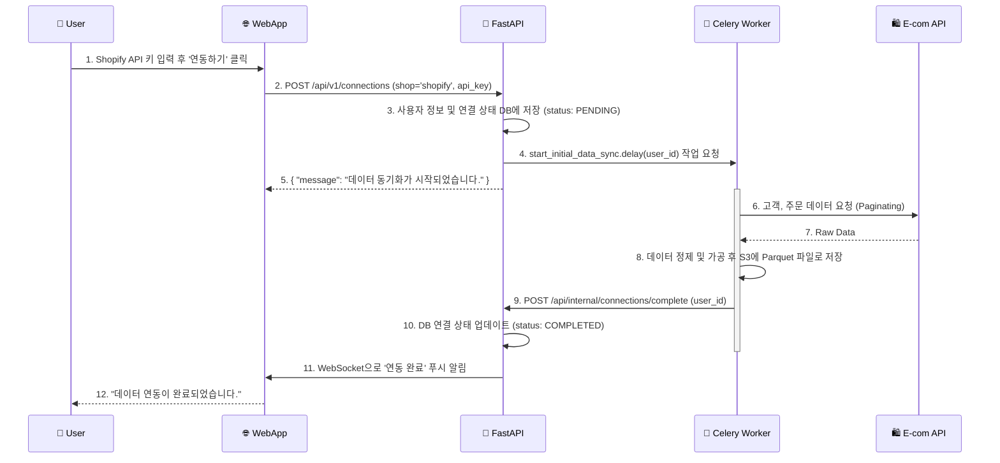
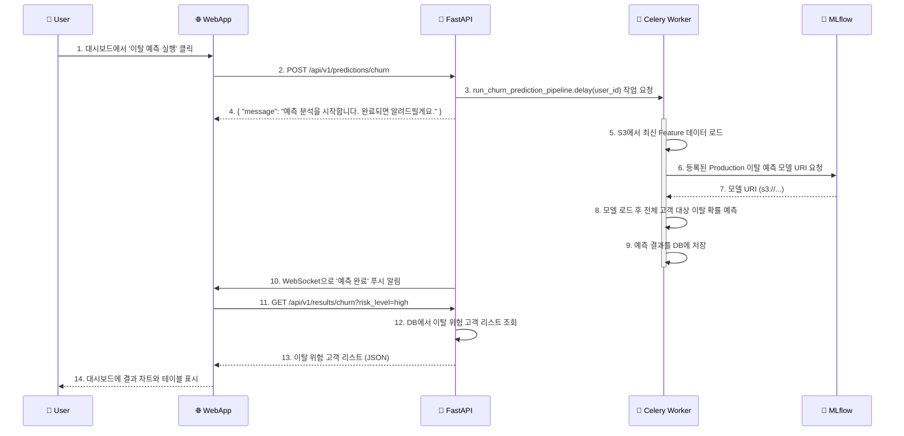
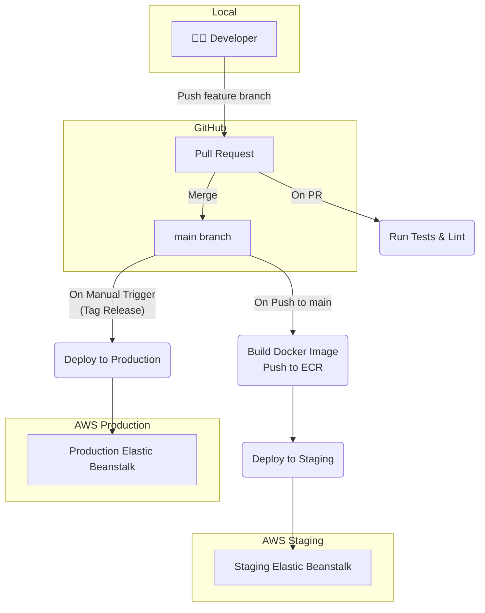

# 🚀 AI 예측 분석 SaaS 플랫폼 구축 제안서 (V2)

## 1. 제안 개요 (Proposal Summary)

본 문서는 '이커머스 SMB를 위한 AI 예측 분석 플랫폼'의 성공적인 MVP(Minimum Viable Product, 최소 기능 제품) 구축을 위한 기술 제안서입니다.

복잡한 초기 아키텍처 대신, **개발 비용과 시간을 최소화**하고 **빠른 시장 검증**에 집중할 수 있는 **현실적이고 실용적인 아키텍처**를 제안합니다. 이 제안서는 프로젝트의 기술적 청사진이자, 개발팀을 위한 구체적인 가이드 역할을 할 것입니다.

- **핵심 문제**: 이커머스 SMB는 데이터는 있지만, 분석할 전문가와 시간, 예산이 없다.
- **핵심 해결책**: 클릭 몇 번으로 고객 이탈율과 생애 가치를 예측하고, 실행 가능한 마케팅 대상을 알려주는 **저렴하고 쉬운 SaaS**.

## 2. 프로젝트 목표 (Project Goals)

- **비즈니스 목표**:
  - 3개월 내 MVP 출시하여 초기 유료 고객 10개사 확보.
  - 고객사의 이탈률 10% 감소 또는 LTV 15% 향상이라는 명확한 성공 사례 창출.
- **기술적 목표**:
  - **비용 효율적 아키텍처**: 초기 운영 비용을 최소화하는 관리형 서비스(Managed Service) 중심의 아키텍처 구축.
  - **자동화된 ML 파이프라인**: 데이터 수집, 훈련, 예측의 핵심 과정을 자동화하여 운영 리소스 최소화.
  - **확장 가능한 설계**: 서비스 성장 시 유연하게 확장할 수 있는 구조 설계 (Monolith First, Microservice Later).

## 3. MVP 시스템 아키텍처 (Pragmatic Architecture for MVP)

초기 단계에서는 복잡한 쿠버네티스나 마이크로서비스 대신, 단일 애플리케이션(Monolith)을 중심으로 구성하여 개발 및 배포의 복잡성을 낮춥니다.

```mermaid
graph TD
    subgraph "User & CI/CD"
        User(👤 SMB User)
        Developer(👩‍💻 Developer) -- "Git Push" --> GitHub
        GitHub -- "GitHub Actions" --> CI_CD
    end

    subgraph "Cloud Infrastructure (AWS)"
        subgraph "Frontend"
            CloudFront[🌐 CloudFront (CDN)] --> S3_Frontend[S3 Bucket for React/Vue App]
        end

        subgraph "Backend (Elastic Beanstalk)"
            ELB[Load Balancer] --> FastAPI_App[🚀 FastAPI App (EC2)]
            FastAPI_App -- "Background Task" --> Celery
            Celery[🔄 Celery Workers (EC2)]
        end

        subgraph "Data & ML Platform"
            RDS[🗄️ PostgreSQL (RDS)]
            S3_Data[💧 Data Lake (S3)]
            Redis[⚡ Cache & Message Broker (ElastiCache)]
            MLflow[🔬 MLflow Server (EC2)]
        end
    end
    
    subgraph "External Services"
        EcommerceAPI[🛍️ E-commerce Platform API]
    end

    User --> CloudFront
    CI_CD -- "Deploy" --> S3_Frontend
    CI_CD -- "Deploy" --> FastAPI_App

    FastAPI_App --> RDS
    FastAPI_App --> Redis
    FastAPI_App --> S3_Data
    FastAPI_App --> MLflow
    FastAPI_App --> EcommerceAPI
    
    Celery --> RDS
    Celery --> Redis
    Celery --> S3_Data
    Celery --> MLflow
    Celery --> EcommerceAPI
```

-   **Frontend**: React/Vue.js로 빌드된 정적 파일을 S3에 호스팅하고, CloudFront(CDN)를 통해 빠르게 전송합니다.
-   **Backend**: AWS Elastic Beanstalk을 사용하여 FastAPI 애플리케이션을 배포합니다. 트래픽에 따라 자동 확장(Auto-scaling)이 가능합니다.
-   **Background Tasks**: 데이터 수집, 모델 훈련 등 시간이 오래 걸리는 작업은 **Celery**를 통해 비동기적으로 처리하여 웹 요청에 영향을 주지 않습니다.
-   **Databases**: 메타데이터는 **Amazon RDS (PostgreSQL)**, 메시지 큐와 캐시는 **ElastiCache (Redis)**, 원본 및 처리 데이터는 **S3**에 저장하여 비용과 관리 효율을 높입니다.
-   **MLOps**: **MLflow** 서버를 별도의 EC2 인스턴스에 구축하여 실험과 모델을 관리합니다.

## 4. 핵심 기능 및 시퀀스 다이어그램 (Core Features & Sequence Diagrams)

#### 4.1. 신규 고객 데이터 연동 및 초기 분석



#### 4.2. 고객 이탈 예측 및 결과 확인



## 5. 컴포넌트 관계도 (Component Diagram)

```mermaid
componentDiagram
    [Web App (React)] as Web
    
    package "Backend (FastAPI on Elastic Beanstalk)" {
      [API Endpoints] as Endpoints
      [Celery Task Dispatcher] as Dispatcher
    }
    
    package "Async Workers (Celery)" {
      [Data Sync Worker]
      [ML Pipeline Worker]
    }

    Endpoints --> Dispatcher

    Dispatcher -- "sends job" --> [Redis (Broker)]
    [Redis (Broker)] -- "delivers job" --> [Data Sync Worker]
    [Redis (Broker)] -- "delivers job" --> [ML Pipeline Worker]

    [Data Sync Worker] --> [E-commerce API]
    [Data Sync Worker] --> [S3 Data Lake]
    
    [ML Pipeline Worker] --> [S3 Data Lake]
    [ML Pipeline Worker] --> [MLflow]
    [ML Pipeline Worker] --> [PostgreSQL (RDS)]

    Web --> Endpoints
    Endpoints --> [PostgreSQL (RDS)]
```
## 6. 데이터 및 알고리즘 플로우 (Data & Algorithm Flow)

#### 6.1. 일일 데이터 동기화 및 자동 재훈련 플로우

```mermaid
graph TD
    A(Start: 매일 03:00 스케줄 실행<br>Celery Beat) --> B[E-commerce API 호출];
    B --> C[어제 자 신규/변경 데이터 수집];
    C --> D[S3 Raw Data Zone에 저장];
    D --> E{주간 재훈련일인가? (e.g., 매주 일요일)};
    E -->|Yes| F[AutoML 재훈련 파이프라인 실행];
    E -->|No| G(End);
    
    subgraph F
        direction LR
        F1[S3의 전체 Raw 데이터 로드] --> F2[Feature Engineering];
        F2 --> F3[AutoML로 최적 모델 탐색<br>(MLflow Experiment Tracking)];
        F3 --> F4[기존 Production 모델과 성능 비교];
        F4 --> F5{새 모델 성능이 더 우수한가?};
        F5 -->|Yes| F6[MLflow Model Registry에 새 모델 등록 및<br>'Production'으로 Stage 변경];
        F5 -->|No| F7(기존 모델 유지);
    end
    F --> G;
```

## 7. 배포 전략 (Deployment Strategy)

**GitHub Actions**를 이용한 CI/CD 파이프라인을 구축하여 코드 품질과 배포 안정성을 확보합니다.



## 8. 기술 스택 (Tech Stack for MVP)

| 구분 | 기술 | 사유 |
| :--- | :--- | :--- |
| **Frontend** | React, TypeScript | 풍부한 생태계, 안정적인 타입 지원 |
| **Backend** | Python, FastAPI | 높은 생산성, 비동기 지원, 자동 API 문서화 |
| **Background** | Celery, Redis | Python 생태계의 표준 비동기 작업 처리 |
| **Database** | PostgreSQL (AWS RDS) | 안정적인 관계형 데이터베이스, 관리 용이성 |
| **Data Storage** | AWS S3 | 저렴하고 확장성 높은 오브젝트 스토리지 |
| **MLOps** | MLflow | 실험/모델 관리의 표준, 자체 호스팅으로 비용 절감 |
| **Deployment** | Docker, AWS Elastic Beanstalk | 관리형 서비스로 인프라 관리 부담 최소화 |
| **CI/CD** | GitHub Actions | Git 저장소와 통합된 편리한 CI/CD 환경 |

## 9. 단계별 개발 로드맵 (Phased Development Roadmap)

1.  **Phase 1: MVP (3개월)**
    -   **목표**: 핵심 가치 검증
    -   **기능**:
        -   Shopify 플랫폼 연동
        -   **고객 이탈 예측** 기능
        -   결과 확인을 위한 기본 대시보드
    -   **결과물**: 초기 유료 고객 사용 가능한 최소 기능 제품

2.  **Phase 2: 확장 (이후 3개월)**
    -   **목표**: 서비스 확장 및 고도화
    -   **기능**:
        -   **LTV 예측** 기능 추가
        -   Cafe24, WooCommerce 등 지원 플랫폼 확대
        -   마케팅 액션 제안 기능 (e.g., 이탈 위험 고객 쿠폰 발송)

3.  **Phase 3: 성숙 (이후 6개월)**
    -   **목표**: 기술적 우위 확보
    -   **기능**:
        -   수요 예측, 재고 예측 등 예측 모델 다각화
        -   아키텍처 고도화 (필요시 마이크로서비스 전환 고려)
        -   성능 및 비용 최적화

## 10. 결론

본 제안서는 **"빠른 실행, 낮은 비용, 높은 확장성"** 이라는 MVP의 핵심 철학을 바탕으로 작성되었습니다. 제안된 아키텍처와 로드맵은 초기 시장 진입의 리스크를 최소화하고, 비즈니스 성장에 따라 안정적으로 스케일업할 수 있는 최적의 경로를 제시합니다.

다음 단계로, Phase 1 개발을 위한 구체적인 스프린트 계획과 태스크 분배를 진행할 것을 제안합니다. 