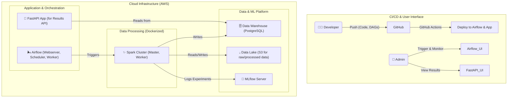
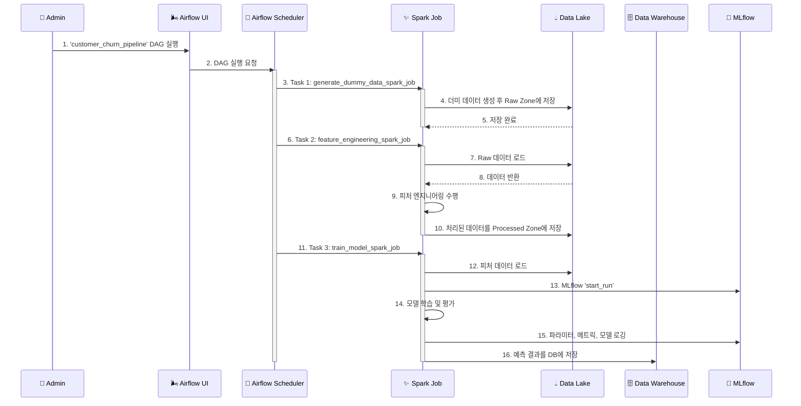

# 🚀 AI 예측 분석 SaaS 플랫폼 구축 제안서 (V3 - 고도화 MVP)

## 1. 제안 개요 (Proposal Summary)

본 문서는 '이커머스 SMB를 위한 AI 예측 분석 플랫폼'의 성공적인 MVP(Minimum Viable Product, 최소 기능 제품) 구축을 위한 **고도화된 기술 제안서**입니다.

단순한 기능 구현을 넘어, **Apache Airflow, Apache Spark** 등 업계 표준 도구를 사용하여 **엔터프라이즈급 MLOps 파이프라인 구축을 경험**하는 것을 목표로 합니다. 이 문서는 팀을 위한 기술적 청사진이자, 구체적인 실행 가이드 역할을 할 것입니다.

- **핵심 목표**: 실제적인 데이터 파이프라인 오케스트레이션과 분산 데이터 처리 기술을 적용하여, 확장 가능하고 안정적인 MLOps 아키텍처를 구축하고 경험합니다.

## 2. 프로젝트 목표 (Project Goals)

- **기술적 목표**:
  - **고도화된 파이프라인 구축**: `Airflow`를 이용한 데이터 파이프라인 스케줄링 및 `Spark`를 이용한 대용량 데이터 처리/피처 엔지니어링 파이프라인을 구축합니다.
  - **엔터프라이즈 MLOps 경험**: 실제 기업 환경에서 사용되는 표준적인 데이터 및 MLOps 스택을 직접 구축하고 운영하는 경험을 확보합니다.
  - **자동화 및 확장성**: 데이터 처리부터 모델 학습, 배포까지의 전 과정을 자동화하고, 향후 대규모 트래픽과 데이터를 수용할 수 있는 확장 가능한 아키텍처의 기반을 마련합니다.

## 3. 고도화 MVP 시스템 아키텍처

`Celery`와 개별 스크립트 대신, 파이프라인 오케스트레이션을 위해 `Airflow`를, 대용량 데이터 처리를 위해 `Spark`를 도입합니다.

-   **Orchestration**: **Apache Airflow**가 전체 데이터 파이프라인(DAG: Directed Acyclic Graph)의 실행, 스케줄링, 모니터링, 재시도를 모두 관리합니다.
-   **Data Processing**: **Apache Spark**가 Airflow에 의해 트리거되어, S3 Data Lake의 데이터를 읽어와 분산 처리를 통해 피처를 생성하고, 결과를 Data Warehouse(PostgreSQL) 및 S3에 다시 저장합니다.
-   **Application**: **FastAPI**는 예측 결과를 조회하는 간단한 API와 UI의 역할만 수행합니다. 파이프라인의 실행 및 모니터링은 주로 **Airflow UI**를 통해 이루어집니다.
-   **MLOps & Storage**: **MLflow**는 Spark 작업 내에서 모델 실험을 기록하는 데 사용되며, **S3**는 원시 데이터와 처리된 데이터, 모델 아티팩트까지 저장하는 핵심 스토리지(Data Lake) 역할을 합니다.

## 4. 핵심 워크플로우: Airflow DAG 실행

## 5. 기술 스택 (Tech Stack for MVP)

| 구분 | 기술 | 사유 |
| :--- | :--- | :--- |
| **Orchestration** | **Apache Airflow** | 복잡한 데이터 파이프라인의 스케줄링 및 관리를 위한 업계 표준 도구 |
| **Data Processing**| **Apache Spark** | 대용량 데이터 분산 처리 및 피처 엔지니어링을 위한 표준 기술 |
| **Backend** | Python, FastAPI | 결과 조회를 위한 경량 API 서버 및 간단한 UI 제공 |
| **Database** | PostgreSQL | 정제된 데이터 및 예측 결과를 저장하는 Data Warehouse 역할 |
| **Data Storage** | AWS S3 | 원시/가공 데이터, 모델 아티팩트를 모두 저장하는 Data Lake |
| **MLOps** | MLflow | 실험/모델 관리 및 추적의 표준 |
| **Deployment** | Docker, Docker Compose | 개발 환경의 일관성 및 배포 편의성 확보 |
| **CI/CD** | GitHub Actions | 코드 및 DAG 파일의 테스트와 배포 자동화 |

## 6. 단계별 개발 로드맵 (Phased Development Roadmap)

### Phase 1: 고도화 MVP (3개월)
- **목표**: Airflow + Spark 기반의 MLOps 파이프라인 핵심 구축 및 경험
- **주요 Task**
    1. **인프라 구축 (Data Engineer / Infra)**
        - `docker-compose.yml`을 사용하여 Airflow, Spark, PostgreSQL, MLflow 등 모든 서비스 컨테이너화 및 실행 환경 구축
        - Airflow와 Spark 클러스터가 서로 통신할 수 있도록 네트워크 설정
        - `pyproject.toml`로 의존성 관리 및 `.env`로 설정 분리
    2. **데이터 파이프라인 개발 (Data Engineer)**
        - **(Task 1)** `PySpark`를 사용하여 더미 데이터를 생성하고 S3에 저장하는 Spark Job 코드 작성
        - **(Task 2)** S3의 데이터를 읽어 피처를 생성하고 다시 S3와 PostgreSQL에 저장하는 Spark Job 코드 작성
        - **(Task 3)** 위 Spark Job들을 순차적으로 실행하는 **Airflow DAG (`customer_churn_pipeline.py`)** 작성
    3. **모델 개발 및 실험 (ML Engineer)**
        - **(Task 4)** 피처 엔지니어링이 완료된 데이터를 Spark 데이터프레임으로 받아 모델(XGBoost on Spark 등)을 학습시키는 Spark ML Job 코드 작성
        - MLflow와 연동하여 실험 파라미터, 메트릭, 모델을 로깅하는 로직 구현
        - 이 모델 학습 Job을 Airflow DAG의 마지막 Task로 추가
    4. **결과 확인 API/UI (API Developer)**
        - PostgreSQL에 저장된 최종 예측 결과를 조회하는 FastAPI 엔드포인트(`GET /api/v1/results`) 구현
        - 조회된 결과를 간단한 테이블/차트로 보여주는 Jinja2 템플릿 페이지 작성
    5. **CI/CD 및 자동화 (Infra)**
        - GitHub Actions를 사용하여 코드 Push 시 Airflow DAG 유효성 검사, Python 코드 테스트 자동화
        - `main` 브랜치 병합 시 새로운 DAG 파일이 자동으로 Airflow 서버에 배포되도록 CI/CD 파이프라인 구축

### Phase 2: 확장 및 고도화
- **목표**: 실제 데이터 소스 연동 및 운영 안정성 강화
- **주요 Task**
    - 실제 이커머스 플랫폼(Shopify 등) 데이터 수집을 위한 Spark Job 및 Airflow DAG 개발
    - 데이터 품질 검증(Great Expectations 등) 단계 추가
    - 모델 모니터링 및 자동 재학습 트리거 로직 구현
    - Kubernetes(EKS) 기반으로 인프라 전환 고려

## 7. 결론

본 문서는 단순한 MVP를 넘어, **실제 기업 환경에서 마주할 수 있는 기술 스택과 아키텍처를 경험**하는 것을 목표로 하는 고도화된 프로젝트 계획을 제시합니다. 이 과정을 통해 팀은 확장성 있고 안정적인 MLOps 파이프라인을 구축하는 핵심 역량을 확보하게 될 것입니다.
